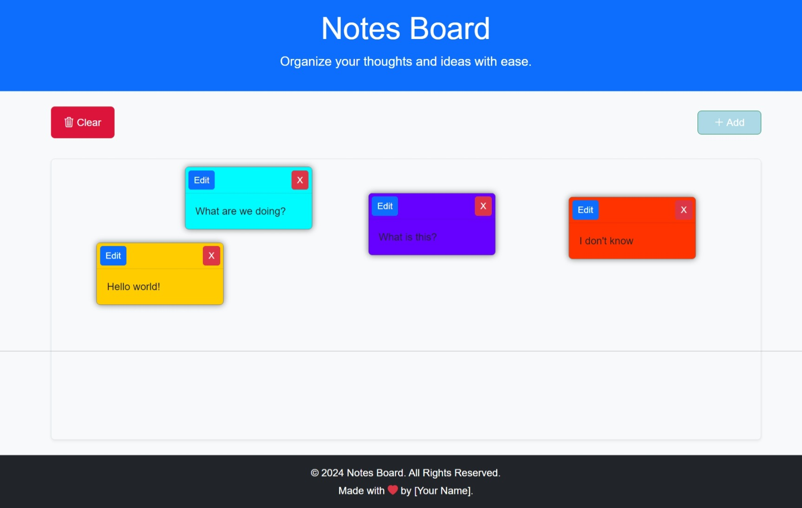

# 🗒️ Post it-ly

**Thanks for choosing Sticky-Notes Board!** This is the perfect place to declutter your mind & organize your thoughts. You can store quick notes or jot down important lists with the click of a button. Sticky-Notes Board will bring peace of mind when you know all your important information is being stored in one place, instead of scattered around your desk on loose pieces of paper.

## 🗄️ Table of Contents

- [Screenshot](#screenshot)
- [Give It A Try](#💻give-it-a-try)
- [App Structure](#🏗️app-structure)
- [Technologies Used](#📋technologies-used)
- [Contributors](#🤝contributors)
- [Thank You](#😎👍thank-you)

## Screenshot

## 💻Give it a Try

Click the link to try Sticky-Notes Board: [https://lesley-byte.github.io/Post-It-ly/](https://lesley-byte.github.io/Post-It-ly/)

## 🏗️App Structure

- **index.html:** This is the main entry point for the Sticky-Notes Board app & it contains the basic structure of the webpage. It links to the style.css for styling and script.js for functionality.
- **style.css:** This file contains the CSS code that defines the overall look & feel of the app. It also contains additional styles to ensure responsiveness across devices. The styles are applied to the elements defined in index.html to enhance the user experience.
- **script.js:** This file contains the JavaScript code that handles the app's functionality. It contains the core logic, utility functions (e.g., creating, editing, & deleting the notes), and local storage that can be reused throughout the app. The script.js file interacts with the elements in index.html by manipulating the DOM, based on the user's actions (i.e., clicking buttons or typing notes).

## 📋Technologies Used

- **Bootstrap:** Utilized to create a responsive and modern user interface, allowing the Sticky-Notes Board to function seamlessly across various devices.
- **HTML / CSS:** Used for the structure & styling of the app.
- **JavaScript:** Implemented for the interactive functionalities of the app, including note creation and local storage management.

## 🤝Contributors

- **Lauren DeGrazia:** [GitHub Profile](https://github.com/LDegraz) - Developed the local storage code in JavaScript, created the README using markdown, & ogranized the presentation so collaborators could easily add work.
- **Tyreone Sarpong:** [GitHub Profile](https://github.com/Tyreone58) - Developed the Javascript code for a responsive & functional website, & added contributions to the README & group presentation.
- **Grace Halpin:** [GitHub Profile](https://github.com/PentelX) - Developed the CSS code to style the website, utilized Bootstrap for a responsive design, & added contributions to the README & group presentation.
- **Thomas Korlewala:** [GitHub Profile](https://github.com/Tobby45bay) - Developed the Javascript code for a responsive & functional website, & added contributions to the README & group presentation.

## 😎👍Thank You

This project was created with the intention of helping individuals organize their thoughts & declutter their minds. We hope you find Sticky-Notes Board to be a useful tool in your daily life. If you have any feedback or suggestions, please feel free to reach out to us. We appreciate your support and hope you enjoy using Sticky-Notes Board! 📝
